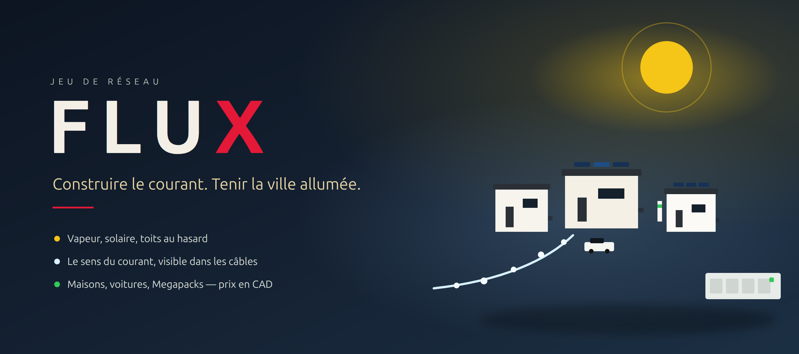
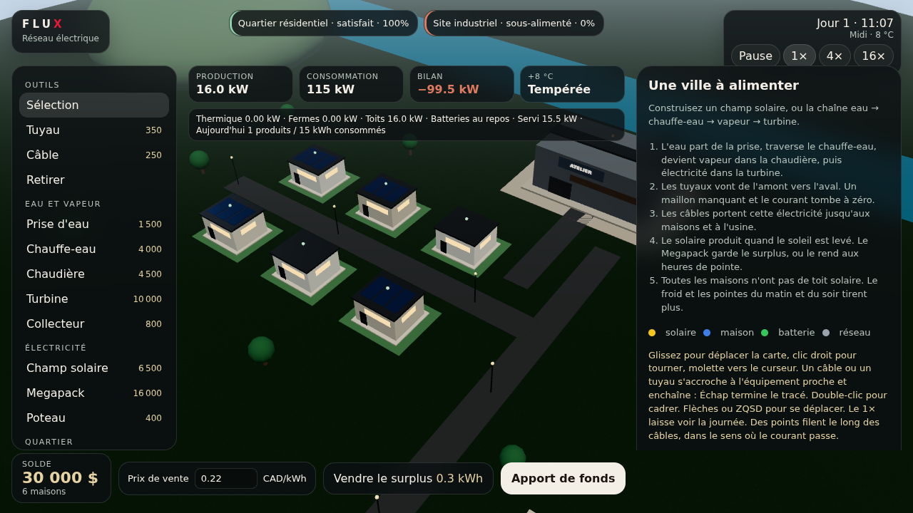

<p align="center">
  
</p>

<p align="center">
  
  <br>
  <em>Premier matin. Les toits tiennent le quartier. L'usine attend encore son câble.</em>
</p>

---

L'eau entre, chauffe, devient vapeur, puis électricité. Le soleil fait le reste quand il est là. À toi de mener ce courant jusqu'aux maisons et à l'atelier, et de le vendre quand il dépasse.

La ville ne s'arrête pas si elle a faim. Elle le montre.

| Produire | Conduire | Tenir |
| --- | --- | --- |
| Chaîne thermique, champ solaire, toits qui n'équipent pas toutes les maisons. | Tuyaux d'amont en aval. Des points filent sur les câbles, dans le sens du courant. | Quartier et usine satisfaits, ou non. Le froid et les pointes se voient dans les chiffres. |

## La journée

Le temps au **1×** laisse passer une journée en vingt minutes environ. Le matin, des voitures partent. Le soir, elles rentrent moins chargées et se branchent. Une journée froide tire plus, surtout aux heures de pointe.

Le tableau suit la production, la consommation et le bilan, en direct. L'argent est en **dollars canadiens**. Le surplus se vend au prix que tu fixes. S'il manque pour construire, un apport de fonds débloque le chantier.

Les maisons peuvent arriver seules. Le bouton les arrête : tu les poses alors toi-même, Powerwall ou voiture.

## Sous la main

Un clic sur un Megapack ouvre de vrais réglages. **En service** coupe la batterie. **Puissance max** plafonne les kilowatts. Auto, Charger, Décharger et Conserver changent ce qu'elle fait, et la réserve empêche de la vider trop bas. La turbine, le solaire et la chaîne thermique ont le même plafond.

| Geste | Effet |
| --- | --- |
| Glisser | Déplace la carte, le sol sous le curseur |
| Clic droit | Tourne autour du quartier |
| Molette | Zoom vers le curseur |
| Câble ou tuyau | S'accroche, puis enchaîne. Échap termine |
| Double-clic, ou F | Cadre la sélection |
| Flèches, ZQSD | Se déplace sur la carte |

## Ouvrir

Depuis le dossier du jeu :

```bash
python3 -m http.server 8080
```

Puis [http://127.0.0.1:8080](http://127.0.0.1:8080). La page s'ouvre aussi directement : les scripts sont classiques, sans installation.
